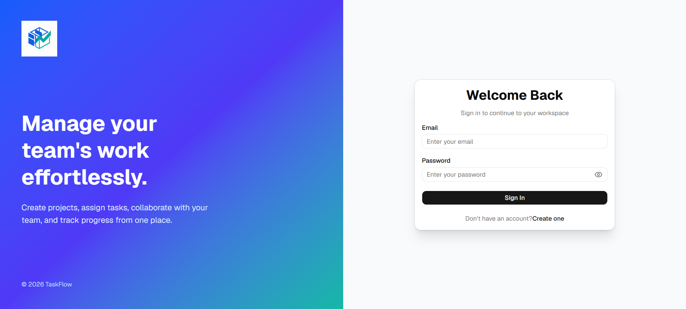
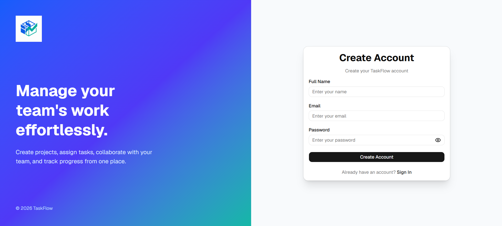
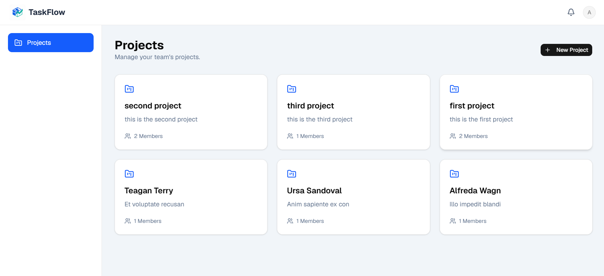
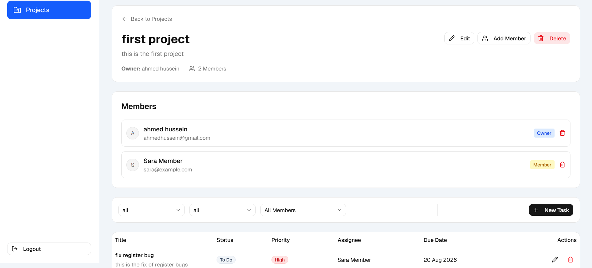
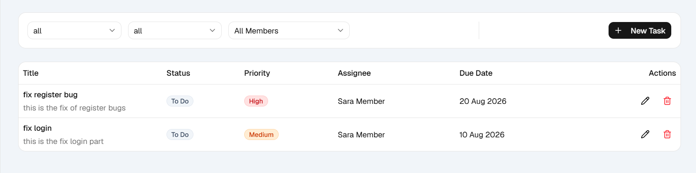
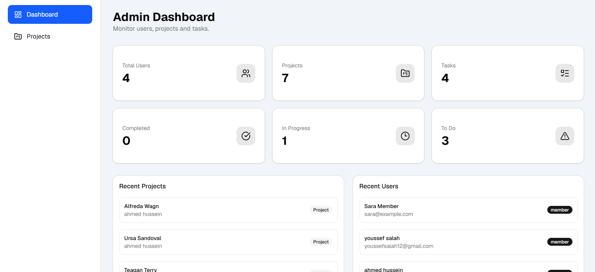

# (TaskFlow) Task Management System

A full-stack Task Management System built with **Node.js, Express, MongoDB, React, TypeScript, and JWT Authentication**.

The application allows teams to manage projects, assign members, create tasks, track progress, and provides an Admin Dashboard for monitoring the system.

---

# Features

## Authentication

- User Registration
- User Login
- JWT Authentication
- Secure Password Hashing (bcrypt)
- Protected Routes
- Role-based Authorization (Admin / Member)

---

## Projects

- Create Project
- View Accessible Projects
- Update Project
- Delete Project
- Project Details
- Add Members (Admin Only)
- Remove Members (Admin Only)

---

## Tasks

Each project supports:

- Create Task
- Update Task
- Delete Task
- View Tasks

Each task contains:

- Title
- Description
- Status
- Priority
- Due Date
- Creator
- Assignee

Supported Statuses:

- To Do
- In Progress
- Done

Supported Filters:

- Status
- Priority
- Assignee

---

## Admin Dashboard

Admin users can view:

- Total Users
- Total Projects
- Total Tasks
- Recent Users
- Recent Projects

---

## Frontend

- Responsive UI
- Login & Register Pages
- Project Dashboard
- Project Details
- Task Table
- Loading States
- Empty States
- Error Handling
- Client-side Validation
- Toast Notifications

---

# Tech Stack

## Backend

- Node.js
- Express.js
- MongoDB
- Mongoose
- JWT
- bcrypt
- Zod
- Jest
- Supertest

## Frontend

- React
- TypeScript
- Vite
- React Router
- React Query
- React Hook Form
- Zod
- Tailwind CSS v4
- shadcn/ui
- Axios
- Sonner

---

# Project Structure

```
task-management-system
│
├── backend
│   ├── src
│   │   ├── controllers
│   │   ├── services
│   │   ├── routes
│   │   ├── middlewares
│   │   ├── models
│   │   ├── validations
│   │   ├── utils
│   │   └── tests
│
└── client
    ├── src
    │   ├── api
    │   ├── components
    │   ├── context
    │   ├── hooks
    │   ├── layouts
    │   ├── pages
    │   ├── routes
    │   ├── schemas
    │   ├── types
    │   └── utils
```

---

# Roles

## Admin

- Manage Projects
- Add Members
- Remove Members
- Create/Edit/Delete Tasks
- View Admin Dashboard

## Member

- View Assigned Projects
- Manage Tasks within Accessible Projects

---

# Authorization Rules

- Only authenticated users can access protected APIs.
- Users only see projects they have access to.
- Unauthorized users cannot modify projects or tasks.
- Only Admins can manage project members.
- JWT is required for protected endpoints.

---

# Environment Variables

Create a `.env` file inside the backend folder.

```env
PORT=3000

DATABASE_URI=your_mongodb_connection
DATABASE_PASSWORD=your_database_PASSWORD

JWT_SECRET=your_secret

JWT_EXPIRES_IN=7d

NODE_ENV=development
```

---

# Installation

## Clone Repository

```bash
git clone https://github.com/your-username/task-management-system.git
```

---

## Backend

```bash
cd backend

npm install

npm run dev
```

---

## Frontend

```bash
cd client

npm install

npm run dev
```

---

# Seed Data

Run the seed script:

```bash
npm run seed
```

Example Accounts:

### Admin

```
Email:
admin@test.com

Password:
Admin123@
```

### Member

```
Email:
member@test.com

Password:
Member123@
```

---

# Running Tests

```bash
npm test
```

or

```bash
npm run test
```

The project includes automated backend tests covering authentication, projects, members, and tasks.

---

# API Documentation

A complete Postman Collection is included in this repository.

Import the collection into Postman to test all endpoints.

- **Swagger UI:** `http://localhost:3000/api-docs`
- **Postman Collection:** `docs/postman/Task-management-system.postman_collection.json`

---

# Screenshots

## Login



---

## Register



---

## Projects



---

## Project Details



---

## Task Table



---

## Admin Dashboard



---

# Author

**Mohamed Mahmoud**

- GitHub: https://github.com/MohamedMahmoud01110
- LinkedIn: https://www.linkedin.com/in/mohamed-mahmoud-233421263/

---

# License

This project was developed as part of a **Full Stack Node.js Technical Assessment**.
